## Титул
## Вивчення Git
## Виконав студент: Прокопенко Євгеній ІПЗ-4.04
## з дисципліни: **"Розробка та програмування координатних систем"**

## Конфігурація середи

Використовуючи наступні git команди, виконаємо встановлення пошти та імені користувача:

> git config --global user.name "deyouare"

> git config --global user.email "deyouare@gmail.com"

Встановимо назву головної гілки за замовчуванням:

> git config --global init.defaultBranch main

Вставновимо правила обробки закінчень файлів:

> git config --global core.autocrlf true

> git config --global core.safecrlf warn

## Стартовий проєкт

#### 1. Створення стартового проєкта

Створимо нову директорію для проєкта, перейдемо до неї та створимо там html файл, наступними командами:

```bash
mkdir work
cd work
touch hello.html
```

Виконаємо ініціалізацію git:

> git init

Додамо файл `hello.html` до репозиторія:

> git add hello.html

Створимо перший коміт доданих файлів з повідомленням `Initial Commit`:

> git commit -m "Initial Commit"

Перевіримо статус репозиторія:

> git status

**Результат:**

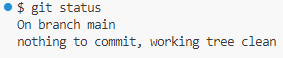

Поточна гілка — головна, нема файлів для створення комітів.

#### 2. Зміна файлів

Змінимо вміст файла `hello.html`:

```html
<h1>Hello, World!</h1>
```

Перевіримо статус репозиторія:

> git status

**Результат:**

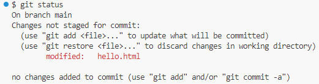

Git відзначив наявність змін у файлі `hello.html`.

Додамо поточний стан файла до наступного коміту та перевіримо статус репозиторія:

> git add hello.html

> git status

**Результат:**

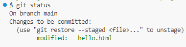

Git відзначив готовність `hello.html` до коміту.

Створимо коміт та переглянемо історію проєкта:

> git commit -m "Added h1 tag"

> git log --oneline

**Результат:**

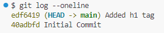

Можна побачити два наявних коміта з відповідними повідомленнями, що були додані раніше.

#### 3. Отримання старих версій

Перевіримо поточний вміст файлу `hello.html`:

> cat hello.html

**Результат:**

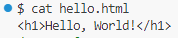

Переключимось на стару версію репозиторію на перший коміт:

> git checkout 40adbfd

Перевіримо поточний вміст файлу `hello.html`:

> cat hello.html

**Результат:**

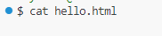

Як можна побачити, ми повернулись на пусту версію файлу `hello.html`.

Повернемося до останнього коміту:

> git switch main

Знов перевіримо вміст файлу `hello.html`:

> cat hello.html

**Результат:**

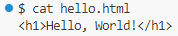

#### 3. Тагування

Виконаємо тагування комітів:

```bash
git tag v1-beta 40adbfd
git tag v1 edf6419
```

Перевіримо встановлені таги:

> git tag

**Результат:**

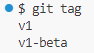

Усього було додано два тега: `v1-beta` та `v1`.

#### 4. Скасування запланованих дій

Змінимо файл `hello.html`:

> cat hello.html

**Результат:**

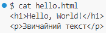

Заплануємо зміну файла до коміту:

> git add hello.html

Перевіримо статус репозиторія:

> git status

**Результат:**

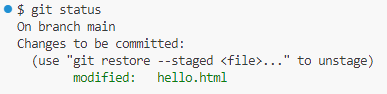

Відмінемо додання файлу `hello.html`:

> git reset HEAD hello.html

Переведемо файл `hello.html` до версії останнього коміту:

> git checkout hello.html

Перевіримо файл `hello.html`:

> cat hello.html

**Результат:**

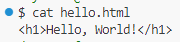

#### 5. Відкат коміту

Зробимо зміни до файлу `hello.html` та створимо новий коміт:

```bash
git add hello.html
git commit -m "Oops, bad commit!"
```

Перевіримо результат:

> git log --oneline

**Результат:**

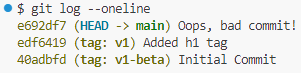

Створимо коміт, який відкатить зміни поточного:

> git revert HEAD

Перевіримо результат:

> git log --oneline

**Результат:**

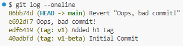

Для видалення зайвих комітів, та відкату до версії `v1`, промаркуємо поточний коміт як `currpoint`:

> git tag currpoint

Перевіримо результат:

> git log --oneline

**Результат:**

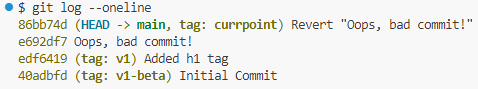

Повернемося до версії `v1`:

> git reset --hard v1

Перевіримо результат:

> git log --all --oneline

**Результат:**

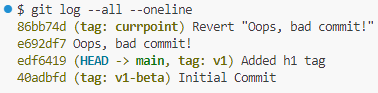

Згідно до результатів, поточним комітом став коміт з тегом `v1`.

Видалимо тег `currpoint`:

> git tag -d currpoint

Перевіримо результат:

> git log --all --oneline

**Результат:**

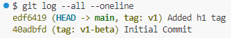

Зайві коміти зникли з історії комітів після видалення тегу, який посилався на останній коміт.

#### 6. Зміна останнього коміту

У початок файлу `hello.html` було додано новий рядок з позначенням автора та електронної адреси:

> cat hello.html

**Результат:**

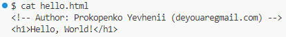

Створимо коміт:

> git add hello.html

> git commit -m "Added copyright statement with email"

Перевіримо результат:

> git log --oneline

**Результат:**

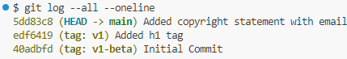

Виправимо файл `hello.html`, додамо забутий символ `@`:

> cat hello.html

**Результат:**

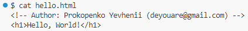

Виконаємо злиття:

> git add hello.html

> git commit --amend -m "Added copyright statement with email"

Перевіримо результат:

> git log --oneline

**Результат:**

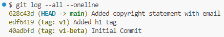

#### 7. Створення гілки

Створімо нову гілку для праці зі стилями:

> git switch -c style

Перевіримо статус репозиторія:

> git status

**Результат:**

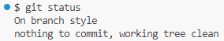

Створилася нова гілка `style`, яка стала поточною гілкою.

Створімо новий файл для стилів

> touch style.css

З вмістом:

```css
h1 {
  color: orange;
}
```

Додамо зміни до коміту:

> git add style.css

> git commit -m "Added css stylesheet"

Відповідно змінимо файл `hello.html`:

```html
<!-- Author: Prokopenko Yevhenii (deyouare@gmail.com) -->
<html>
  <head>
    <link type="text/css" rel="stylesheet" media="all" href="style.css" />
  </head>
  <body>
    <h1>Hello, World!</h1>
  </body>
</html>
```

Додамо зміни до коміту:

> git add hello.html

> git commit -m "Included stylesheet into hello.html"

#### 8. Безпечне перейменування(переміщення) файлів

Змінимо назву файлу `hello.html` на `index.html`: 

> git mv hello.html index.html

Додамо зміни до коміту:

> git add .

> git commit -m "Renamed hello.html"

#### 9. Завантаження репозиторія на github

Додамо посилання на віддалений репозиторій:

> git remote add origin https://github.com/eugenereport/git-learning.git

Завантажимо головну гілку `main` та гілку `style`:

> git push -u origin main

> git push -u origin style

**Результат:**

Перевіримо репозиторій на сайті `https://github.com`.

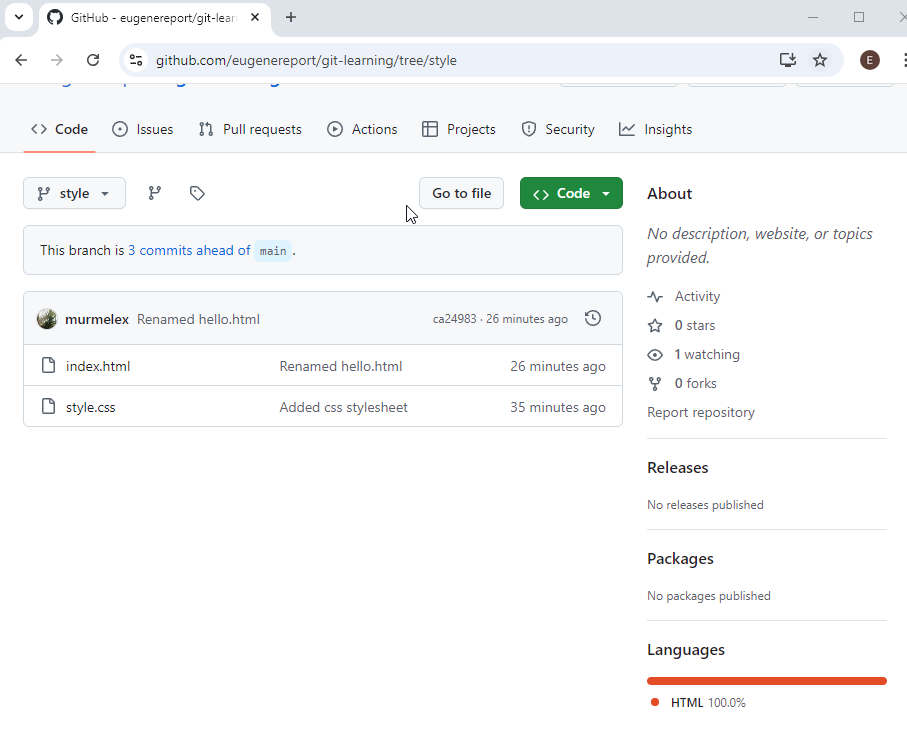

**Репозиторій успішно завантажився на сайт github.com!**

## Висновок

Git — це система контролю версій, яка дозволяє відстежувати зміни в коді та координувати роботу в команді. Він потрібен для того, щоб забезпечити ефективне управління змінами у проектах, дозволяючи працювати декільком розробникам над одним проєктом. Git корисний тим, що забезпечує збереження історії змін, дозволяє швидко повернутися до попередніх версій коду, спрощує процес злиття змін та сприяє кращій організації командної роботи.

У ході виконання цієї роботи я підтвердив теоретичний матеріал з теми системи контролю версій Git, а саме: ознайомився з основами створення репозиторія, збереження та маркування змін у файлах, створення гілок, відкат змін та публікацією проєктів у GitHub.

Отриманні знання та навички являють собою основу при розробці програмних систем, безпечної спільної праці у команді над проєктом, яка дозволяє зберігати зміни у проєкті на кожному визначеному етапі будування системи.